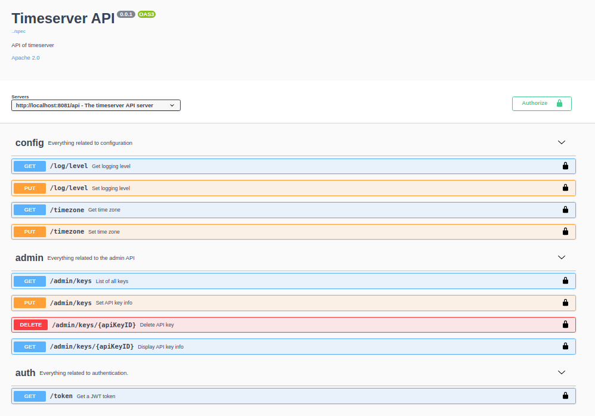
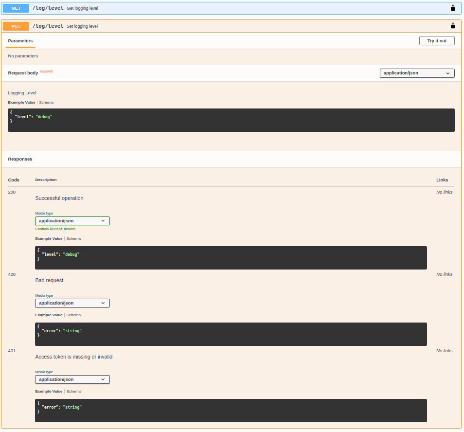

Timeserver
==========

Timeserver is a simple server application that showcases
[OpenAPI](https://www.openapis.org/) and [Swagger
UI](https://github.com/swagger-api/swagger-ui).

The main focus of this project is building and serving the API and GUI. The
home page is simply the current time in some time zone.

```txt
$ curl localhost:8081
"2020-10-25T12:35:50.39742994Z"
```

The API allows us to modify the behavior of the server. We can change the time
zone of the time that it serves, and adapt the logging level.

By default, the time zone is UTC. With a simple call to the API, the time zone
can be changed to any value in [IANA Time Zone
Databas](https://www.iana.org/time-zones)

```txt
$ curl -X PUT "http://localhost:8081/api/timezone" -H  "X-API-KEY: 777269746572" -H  "Content-Type: application/json" -d "{\"timezone\":\"Europe/Zurich\"}"
{
  "timezone": "Europe/Zurich"
}
```

Another query of the home page reveals that the time zone was changed:

```text
$ curl localhost:8081
"2020-10-25T13:44:54.059408243+01:00"
```

To explore the API, the time server also hosts a [Swagger
UI](https://github.com/swagger-api/swagger-ui) under the `/ui` route.

Setup
-----

To start the server run `make run`. At this point, the server will not have
any API keys configured. Add a key by calling the `api-key add` sub-command:

`go run cmd/timeserver/*.go api-key add --user john --role admin <API-KEY>`

Now, the serve will pick up the API key from the file system, and you can start
API requests by providing the `X-API-KEY` header.

API
---

The API is specified in the OpenAPI3 format. The [spec
file](spec/timeserver.yml) describes all the available end points.
They are grouped into three groups:

- `config`
- `admin`
- `token`

The `config` endpoints allow interacting with the server configuration. This API
allows querying and setting the logging level of the server, and querying and
setting the time zone.

The `admin` endpoints allow querying, adding, modifying and deleting API tokens.

The `token` endpoint returns a JWT token that can be used to access the API.
This is mainly done to showcase how we can use both API key and JWT for
authorization at the same time.

Authorization
-------------

Each user that is know to the server has a role associated with them. There
are three roles, each giving varying set of access to the API.

- `config:reader`
- `config:writer`
- `admin`

The `config:reader` and `config:writer` have access to the config and token
endpoint. The `config:reader` can only use the GET endpoints of the API. The
`config:writer` can use both the PUT and the GET endpoints. Both of them can
only obtain a JWT with their role or a less privileged role from the token
endpoint.

The `admin` has access to all of the API.

The API key or the JWT bearer token need to be part of the headers when
accessing the API.

GUI
---

The [Swagger UI](https://github.com/swagger-api/swagger-ui) helps with the
discoverability of the API. It allows us to visually explore all of the API
definitions.



For example, by expanding the PUT `/log/level` endpoint, we can see a sample
request body, and all of the possible response bodies and status codes.



By clicking on the lock on the top right, you can set the API key or the JWT
to authorize the requests. By clicking `Try it out`, you can start API requests
from the GUI directly.

Development
------------

We use three tools to do code generation:

- github.com/deepmap/oapi-codegen
- github.com/markbates/pkger
- github.com/oncilla/boa

Install them in order to update the generated files.

When updating the spec, the generated API code should be updated as well:

```bash
make gen
```

When updating the static Swagger UI files, the packaged gile should be updated
as well:

```bash
make pkger
```

Security
--------

This project is there to show case the OpenAPI 3 spec and the serving the Swagger
UI from the server directly. This is not production grade code, and should not
be used that way. I hope that you already have guessed it based on the lack
of any testing :).

Future Work
-----------

- Play around with [caspbin](https://github.com/casbin/casbin) to replace the
  home grown RBAC
- Play around with [oauth2](https://oauth.net/2/) to replace the custom JWT
  bearer token.
